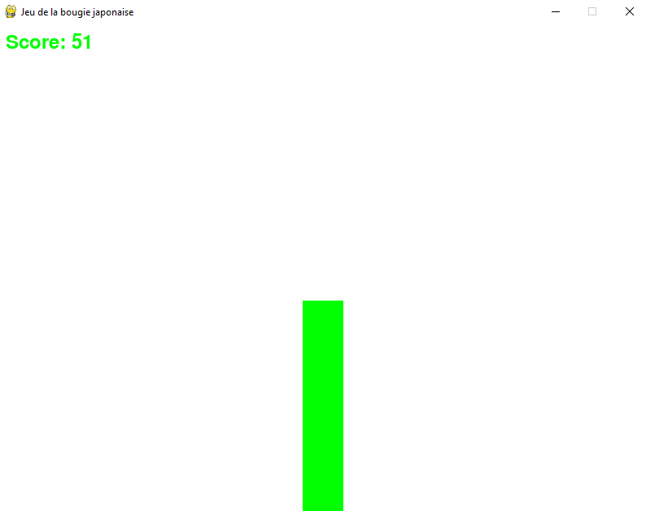

# 🕯️ Candle

**Candle** is a Python game developed to simulate a Japanese candlestick, similar to trading charts. The faster you click, the higher the candle rises, and the harder it becomes to push it upwards. A score increments with each click, and when you stop clicking, the candle slowly descends.

This project is a proof of concept designed to illustrate the concept of **elasticity** in trading and **buying pressure flows**. Eventually, it will serve as a foundation for creating a more elaborate trading bot.

## ✨ Features

- 📈 **Simple GUI** to represent the Japanese candlestick.
- 🖱️ **Click Mechanism:** Click rapidly to make the candle rise.
- 💯 **Score System:** Score increments with each click.
- 📉 **Progressive Decay:** The candle descends gradually when clicks stop.

## 🎮 How to Play

1. **Run the script:** Execute the `Candle.py` file with Python.
2. **Click fast:** Click rapidly to make the candle rise.
3. **Resistance:** The faster you click, the higher it goes.
4. **Score:** Watch your score increase with every click.
5. **Gravity:** When you stop clicking, the candle will slowly fall back down.
6. **Challenge:** Try to get the best score possible by clicking quickly and efficiently.

## ❤️ Contributions

Contributions are welcome! If you want to improve this game or add new features, feel free to open a pull request.

## ⚠️ Note

This project is still a draft and may require improvements. It is a work in progress aimed at illustrating trading concepts and trading bot development.

Enjoy playing Candle and exploring the nuances of elasticity and selling pressure in trading! 📉🚀
